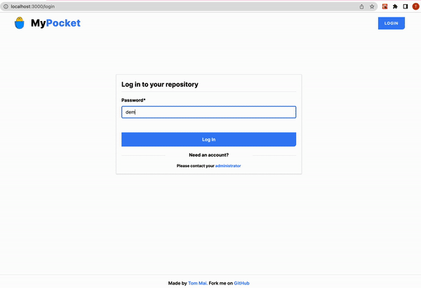

p
A handy application that help user upload and store serve static files. Generally, It is seem like a private asset repository.

## 🔍 Preview
<p align="center>

</p>

## 🚀 Features

**MyPocket** is a application that allow users upload, store and share files with theirs friends, family and co-workers.

Supported features include:

- Sign in to a registered account/repository with an authorized password
- Upload audio, video and image or any other type of files 
- Copy a link of an asset to share with other people
- Displaying all files of a user repository

NOTE: For the purpose of simulation, the current account is **demo** with password **demo**

## 🔧 Setup

### 💻 Client

To set up the client, navigate to the `client` folder and open `.env.example` to configure options:

```sh
REACT_APP_API_URL=http://localhost:3001
```

`API_URL` here refers to the location where the server is hosted. If working locally, no changes need to be made but for production, this should be changed to the domain and port where the server is hosted. When your changes are done, rename `.env.example` to `.env` to allow the project to use it.

Afterwards, install [yarn](https://yarnpkg.com) and run the following two commands to get started:

```sh
yarn install
yarn dev
```

For additional commands and information, please refer to the client [README](client).

### 🌐 Server

To set up the server, navigate to the `server` folder and open `.env.example` to configure options:

```sh
PORT=3001
ADMIN_USERNAME=admin
ADMIN_PASSWORD=password
DEMO_USERNAME=demo
DEMO_PASSWORD=demo
API_KEY=someLongAndComplexStringOfCharacters
API_URL=http://localhost:3001
APP_URL=http://localhost:3000
```

`API_URL` and `APP_URL` refers to the locations where the server and app are located, respectively. If working locally, no changes need to be made but for production, these should be changed to the domain(s) and ports where the two will be hosted. When your changes are done, rename `.env.example` to `.env` to allow the project to use it.

Afterwards, install [yarn](https://yarnpkg.com) and run the following two commands to get started:

```sh
yarn install
yarn dev
```

For additional commands and information, please refer to the server [README](server).

## License

Under the MIT License.